## Graph Strategies

Prior to this chapter, the Primer has covered how to implement the powerful visual-scripting capabilities of Dynamo. A good understanding of these capabilities is a solid foundation and the first step in building robust visual programs. When we implement our visual programs in the field by sharing them with colleagues, achieving a specific result, fixing errors, or testing limits we have additional issues to deal with. If someone else will be using your program or you are expecting to open it six months from now, it needs to have an immediate graphic and logical clarity. Let's walk through several best practices to help you create fully-fledged visual programs.

### Reduce Complexity

As you develop your Dynamo program and test ideas, it can quickly grow in size and complexity. While it is important that you create a functioning program, it is equally important to do it as simply as possible. Not only will your program run faster and more predictably, you along with other users will understand its logic later on.

**Modularize with Groups:**

* To create functionally distinct parts as you build a program
* If you need to move large parts of the program around while maintaining modularity and alignment
* Colors can be used to differentiate what groups are doing \(inputs vs functions\)
* To streamline Custom Node creation

> 1. Function group \(blue\)
> 2. Input group \(orange\)
> 3. Script group \(green\)
>
> For how to use Groups, refer to [Managing Your Program](http://dynamoprimer.com/en/03_Anatomy-of-a-Dynamo-Definition/3-4_best_practices.html).

**Develop efficiently with Code Block:**

* If typing a number or node name is faster than searching \(Point.ByCoordinates, Number, String, Formula\)
* If you have created a large collection of simple nodes they can be written in a single block \(Node to Code\)
* If you want to define a function

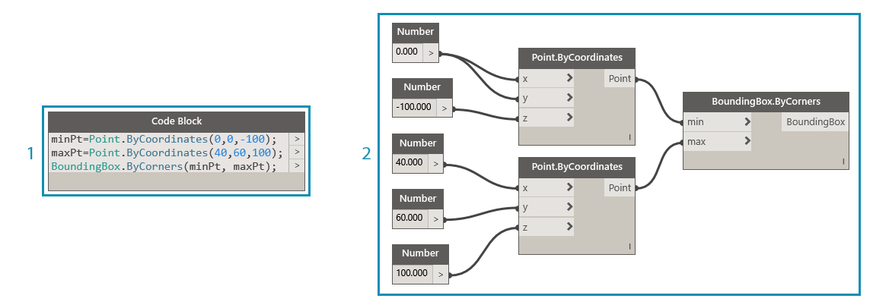

> Both 1 and 2 perform the same function. It was much faster to write a few lines of code than it was to search for and add each node individually. The code block is also far more concise.
>
> 1. Design Script written in Code Block
> 2. Equivalent program in nodes
>
> For how to use Code Block, refer to [What's a Code Block](http://dynamoprimer.com/en/07_Code-Block/7-1_what-is-a-code-block.html).

**Condense with Node to Code:**

* If you have created many nodes that could be easily represented in a single code block 
* If a collection of nodes can be condensed to code without eliminating the program’s clarity
* Pros:
  * Easily condenses code into one component that is still editable
  * Can simplify a significant portion of the graph
  * Useful if the ‘mini-program’ will not often be edited
  * Useful for incorporating other code block functionality, like functions
* Cons:
  * Generic naming makes it less legible
  * More difficult to understand for other users
  * No easy way to return to the visual programming version

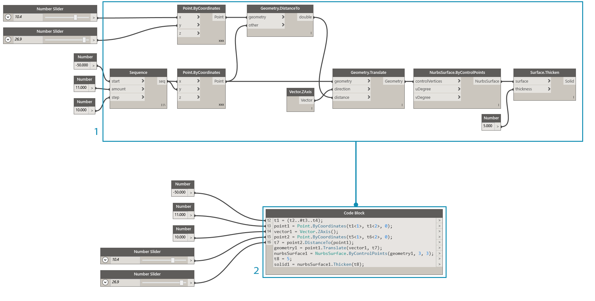

> 1. Existing program
> 2. Code Block created from Node to Code
>
> For how to use Node to Code, refer to [Design Script Syntax](http://dynamoprimer.com/en/07_Code-Block/7-2_Design-Script-syntax.html).

**Access data flexibly with List@Level:**

* If you need to access data at any level in a list of lists
* Instead of the List.Map and List.Combine nodes

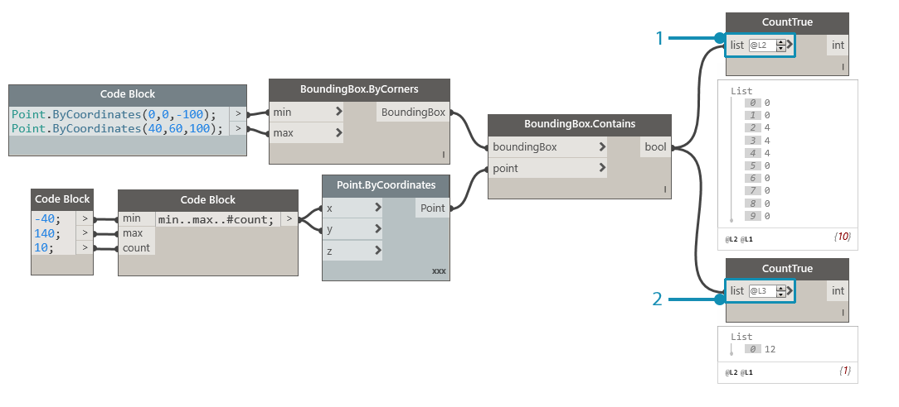

> We can verify how many True values BoundingBox.Contains is returning and in which lists by activating List@Level for CountTrue's "list" input. List@Level allows the user to determine at which level the input will take data from. Using List@Level is flexible, efficient, and highly encouraged over other methods involving List.Map and List.Combine.
>
> 1. Counting true values at List Level 2
> 2. Counting true values at List Level 3
>
> For how to use List@Level, refer to [Lists of Lists](http://dynamoprimer.com/en/06_Designing-with-Lists/6-3_lists-of-lists.html#list@level).

### Maintain Readability

In addition to making your program as simple and efficient as possible, strive for graphic clarity. Despite your best efforts to make your program intuitive with logical groupings, relationships might not be readily apparent. A simple Note inside of a group or renaming a slider can save you \(or another user\) from unnecessary confusion or panning across the graph.

**Visual continuity with Node Alignment:**

* Often and while building your program
* Prior to shipping the program to another user
* Cleanup Node Layout will automatically align your graph, though less precisely than doing it yourself
* Implies a flow

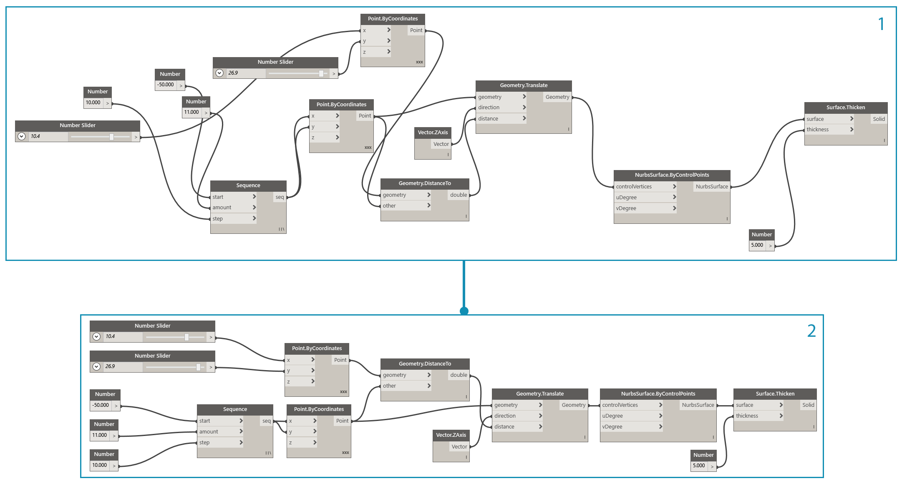

> 1. Unorganized graph
> 2. Aligned graph
>
> For how to use Node Alignment, refer to [Managing Your Program](http://dynamoprimer.com/en/03_Anatomy-of-a-Dynamo-Definition/3-4_best_practices.html).

**Descriptive labeling by renaming:**

* Useful on inputs, especially if what they plug into will be off the screen
* Be wary of renaming nodes other than an inputs. An alternative to this is creating a custom node from a node cluster and renaming that; it will be understood that it contains something else

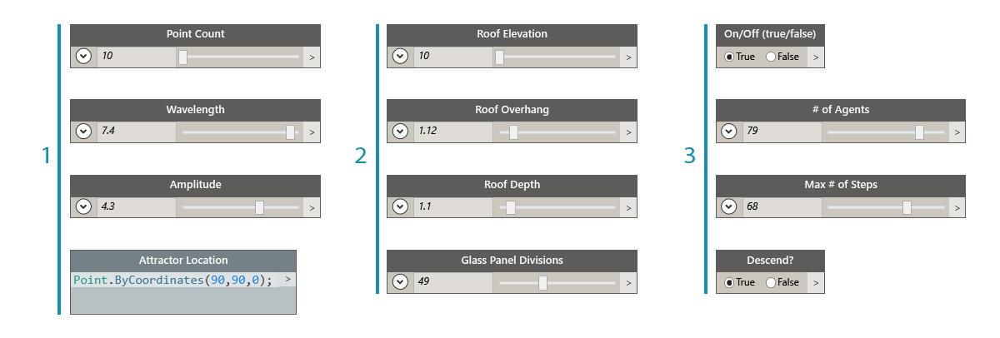

> 1. Inputs for surface manipulation
> 2. Inputs for architectural parameters
> 3. Inputs for drainage simulation script
>
> To rename a node, right click on its name and choose "Rename Node...".

**Explain with Notes:**

* If something in the program requires a plain language explanation
* If a node group is large and can’t be easily understood right away

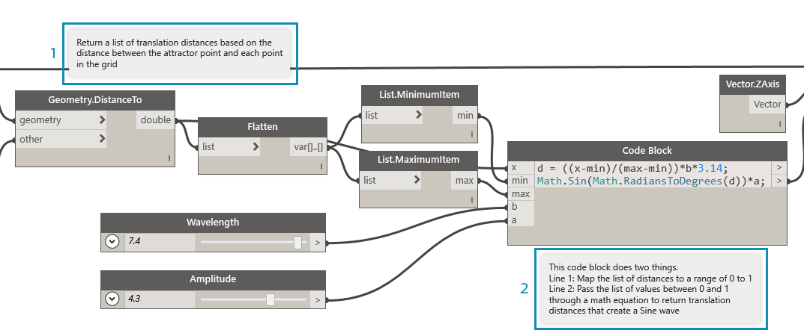

> 1. A Note describing the portion of the program that returns raw translation distances
> 2. A Note describing the code that maps those values to a Sine wave
>
> For how to add a Note, refer to [Managing Your Program](http://dynamoprimer.com/en/03_Anatomy-of-a-Dynamo-Definition/3-4_best_practices.html).

### Flex Continuously

**Monitor data with Watch:**

* As you build the program to verify that key outputs are returning what you expected

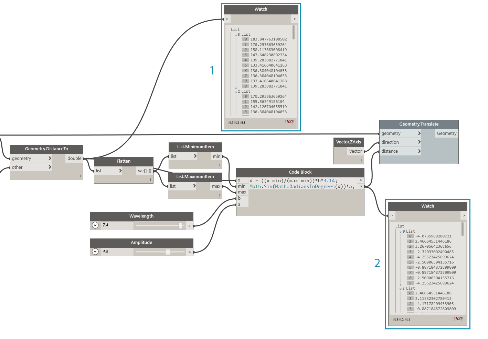

> The Watch nodes are being used to compare:
>
> 1. The raw translation distances
> 2. The values passed through the Sine equation
>
> For how to use Watch, refer to [Library](http://dynamoprimer.com/en/03_Anatomy-of-a-Dynamo-Definition/3-2_dynamo_libraries.html).

### Ensure Reusability

It is highly likely that someone else will be opening your program at some point, even if you are working independently. They should be able to quickly understand what the program needs and produces from its inputs and outputs. This is especially important when developing a Custom Node to be shared with the Dynamo community and used in someone else’s program. These practices lead to robust, reusable programs and nodes.

**Manage the I/O:**

* Minimize inputs and outputs as much as possible
* Determine which inputs and outputs will go into scripts
* Keep inputs generic

**Use Presets to embed input values:**

* If there are particular forms or conditions that you want embedded in the file
* To avoid adjusting the sliders in a program with long run times

> For how to use Presets, refer to [Managing Your Data with Presets](http://dynamoprimer.com/en/03_Anatomy-of-a-Dynamo-Definition/3-5_presets.html).

**Contain groups with Custom Nodes:**

* If a portion of your program can be collected into a single container
* If a portion of a program will be reused often in other programs
* If you want to share a portion of a program with the Dynamo Community

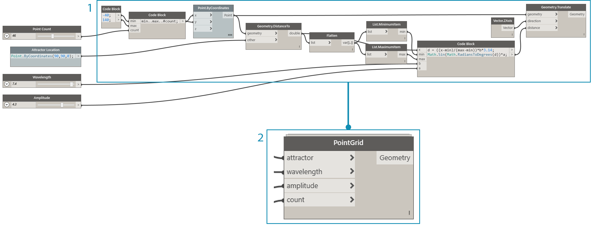

> Collecting the point translation program into a Custom Node makes a robust, unique program portable and far easier to understand. Well named input ports will help other users understand how to use the node. Remember to add descriptions and required data types for each input.
>
> 1. Existing attractor program
> 2. Custom Node that collects this program, PointGrid
>
> For how to use Custom Nodes, refer to [Custom Node Introduction](http://dynamoprimer.com/en/09_Custom-Nodes/9-1_Introduction.html).

### Exercise - Architectural Roof

> Download the example file that accompanies this exercise \(Right click and "Save Link As..."\). A full list of example files can be found in the Appendix. [RoofDrainageSim.zip](datasets/12-2/RoofDrainageSim.zip)

Now that we have established several best practices, let’s apply them to a program that was put together quickly. Though the program succeeds in generating the roof, the state of the graph is a "mind-map" of the author. It lacks any organization or description of its use. We will walk through our best practices to organize, describe, and analyze the program so other users can understand how to use it.

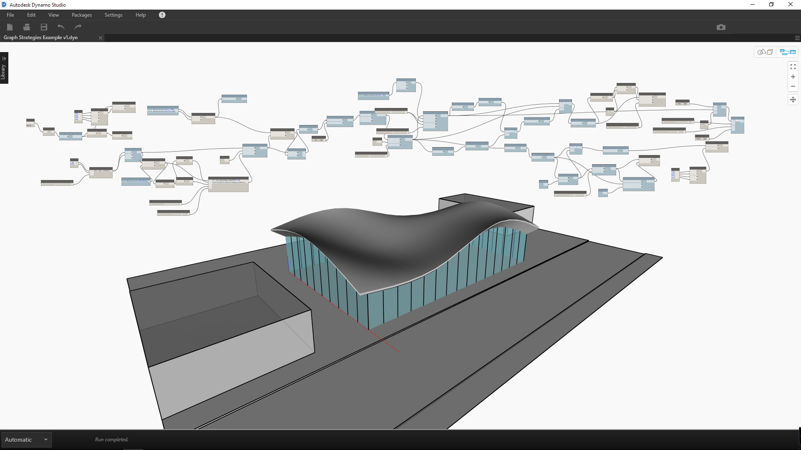

> The program is functioning, but the graph is disorganized.

Let's start by determining the data and geometry returned by the program.

> Understanding when major changes to the data occur is crucial to establishing logical divisions, or modularity. Try inspecting the rest of the program with Watch nodes to see if you can determine groups before moving on to the next step.
>
> 1. This Code Block with a math equation looks like a crucial piece of the program. A Watch node displays that it is returning lists of translation distances.
> 2. The purpose of this area isn't readily obvious. The arrangement of True values at list level L2 from BoundingBox.Contains and the presence of List.FilterByBoolMask suggests we are sampling a portion of the point grid.

Once we understand the elemental parts of the program, let's put them in Groups.

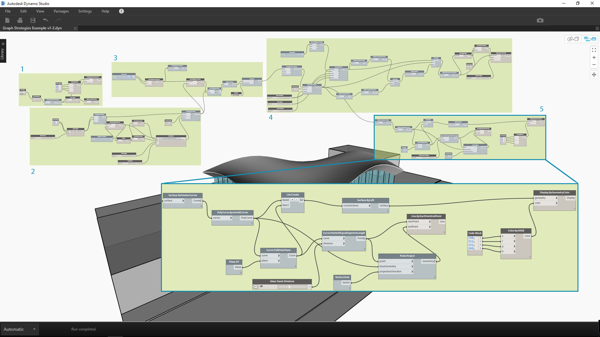

> Groups allow the user to visually differentiate the parts of the program.
>
> 1. Import 3D site model
> 2. Translate point grid based on Sine equation
> 3. Sample portion of point grid
> 4. Create architectural roof surface
> 5. Create glass curtain wall

With Groups established, align the nodes to create visual continuity across the graph.

> Visual continuity helps the user to see the program flow and implicit relationships between nodes.

Make the program more accessible by adding another layer of graphic improvements. Add notes to describe how a specific area of the program works, give inputs custom names, and assign colors to different types of groups.

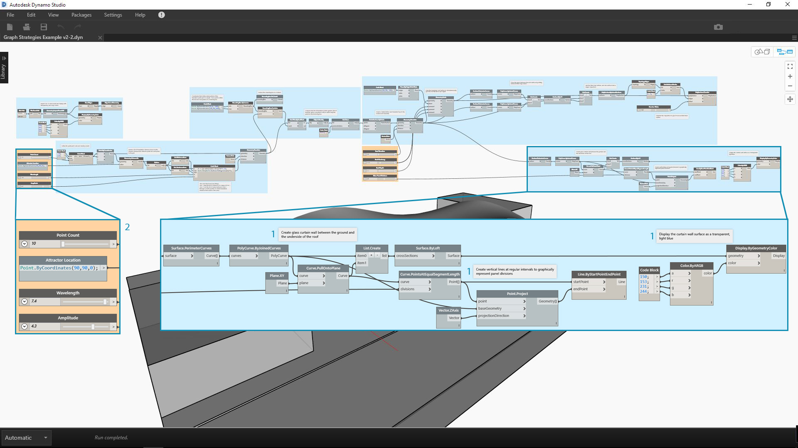

> These graphic improvements tell the user more about what the program is doing. The different group colors help to distinguish inputs from functions.
>
> 1. Notes
> 2. Inputs with descriptive names

Before we start to condense the program, let's find a strategic location to introduce the Python script drainage simulator. Plug the output of the first scaled roof surface into the respective scripting input.

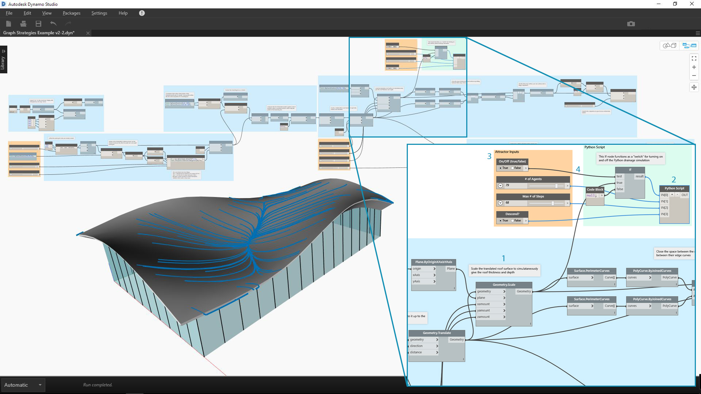

> We've chosen to integrate scripting at this point in the program so the drainage simulation can be run on the original, single roof surface. That specific surface is not being previewed, but it saves us from having to choose the top surface of the chamfered Polysurface.
>
> 1. Source geometry for script input
> 2. Python node
> 3. Input sliders
> 4. On/off "switch"

Let's simplify the graph now that everything is in place.

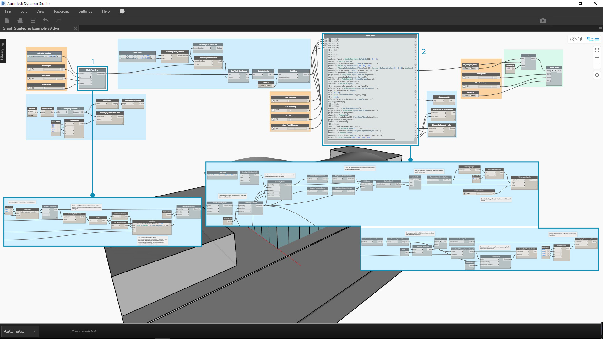

> Condensing our program with Node to Code and Custom Node has greatly reduced the size of the graph. The groups that create the roof surface and walls have been converted to code since they are very specific to this program. The point translation group is contained in a Custom Node as it could be used in another program. In the example file, create your own custom node from the translate points group.
>
> 1. Custom Node to contain the "translate point grid" group
> 2. Node to Code to condense the "create architectural roof surface and curtain wall" groups

As a final step, create presets for exemplary roof forms.

> These inputs are the primary drivers of the roof form and will help users see the potential of the program.

Our program with views of two presets.

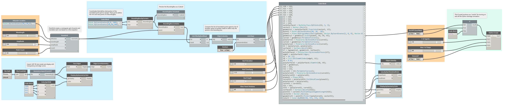

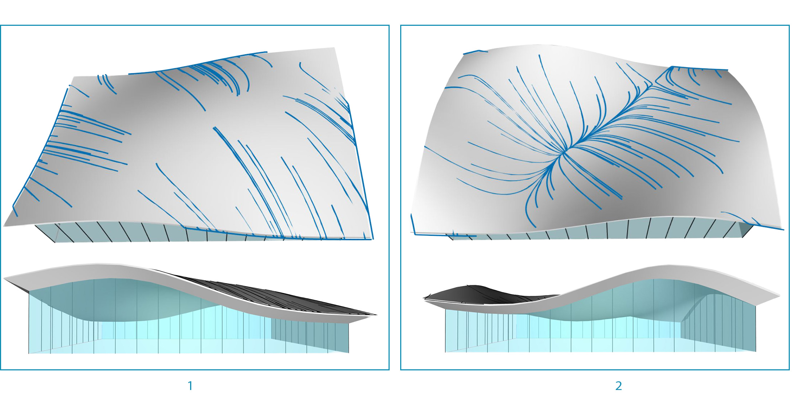

> The roof drainage patterns give the user an analytical view of the respective presets.

